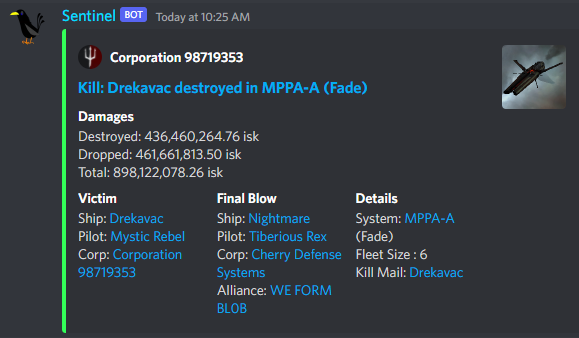

# Eve Kill Stream

Sentinel is a discord bot which streams kills from Zkillboard directly into a discord channel.

## Status

Sentinel has now released v1.2. v1.2 Brings custom embedded messaging, additonal filters, and plenty of other updates and bug fixes.



[Invite Sentinel](https://discord.com/api/oauth2/authorize?client_id=1028896074989043723&permissions=414464728128&scope=bot)

## Commands
Discord's new slash commands are being utilized here!

```/setchannel``` : Set the channel you wish to recieve the killstream in with

```/stop``` : Stop the killstream

```/start``` : Start the killstream

```/status``` : Display the current status muted/unmuted

```/watch {system/region/constellation}``` : Add a filter for the desired system, region, or constellation.

```/watchcorp {corp_id/name/ticker}``` : Add a filter for the desired corporation. You may add by id, name, or ticker

```/watchalliance {alliance_id/name/ticker}``` : Add a filter for the desired alliance. You may add by id, name, or ticker.

```/ignore {system/region/constellation}``` :  Remove the desired filter.

```/ignorealliance {alliance_id/name}```  : Remove the desired alliance filter.

```/ignorecorp {corp_id/name}``` : Remove the desired corporation filter.

```/watchall``` : Removes all filters and opens up the full killstream.

```/allycorp {corporation_id/name/ticker}```: Marks a corporation as your ally. Kills will now be green, and losses red.

```/allyalliance {alliance_id/name/ticker}```: Marks an alliance as your ally. Kills will now be green, and losses red.

```/defaultcolor {color : hexadecimal}:``` Sets the color of neutral kills to your desired hex value


## License

This project is licensed under the [GPL-3.0] License - see the LICENSE file for details

## Acknowledgments

* [sqlalchemy](https://github.com/sqlalchemy/sqlalchemy)
* [discord.py](https://github.com/Rapptz/discord.py)
* [requests-client](https://pypi.org/project/requests-client/)
